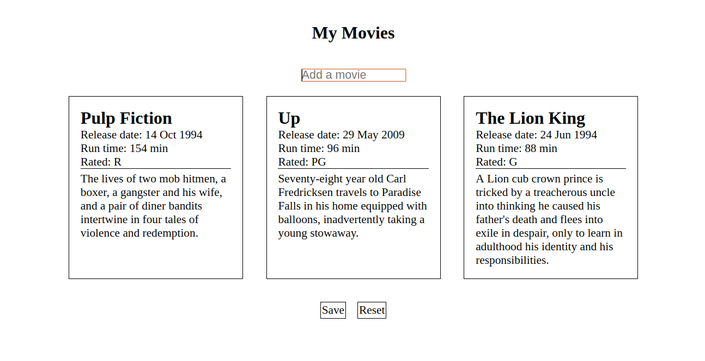

# Movie List

A movie list by populating movies on the page. 

* A movie just displayed once, when the user tries the same movie display an alert.
* The user are able to save their movie list so that when the page is refreshed, their movie list will still be displayed. 
* The user are able to reset the page - this means that the movie list should be removed entirely from the page and nothing should appear if the page is refreshed. 

**Notes**
* API: https://www.omdbapi.com/

**Images**
* Empty Movie List

* Desktop Movie List

* Mobile Movie List

